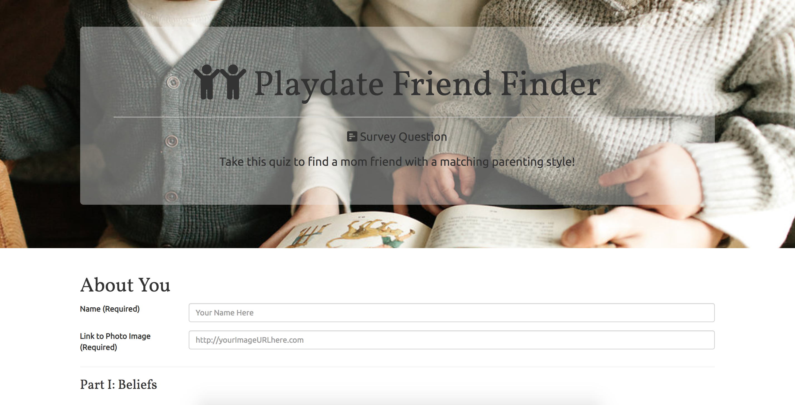
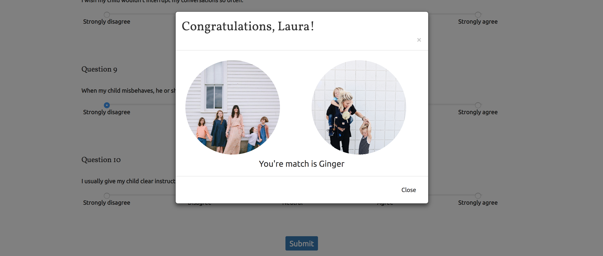

# Playdate Friend Finder

A full-stack compatibility-based  _Playdate Friend Finder_ application (basically a dating app for mommy friends) implemented `Express` to handle routing that makes that data and logic accessible, and deployed to `Heroku` so other users can use it.

---
[Live Demo](https://guarded-fortress-95261.herokuapp.com  "Playdate Friend Finder")

---
## Technologies used
* `Node.js`
* Package to include in our server file:
    * `Express` makes routing easy for us, and we set a variable `App` equal to the function `Express` so we can easily call it.
    * `body-parser` allows us to receive information back in JSON format so it is easy to manipulate.
    * `path` provides utilities for working with file and directory paths. It’s not a npm package. In fact, `path` is built into `Node` itself, but you have to install it. 
* `jQuery`'s `AJAX` methods is used to grab the data from the API-routes, push changes on the client front-end side,  and display data in HTML back to the user.
* `RegEx` 
* `Git`
* `Heroku`
* `Postman` 

---
## How this App Works


The front-end will be composed of a basic survey.


* The back-end will take in results from the user' surveys, save them, then compare their answers with those from other users.


* The app will then display the name and picture of the person whose results are the closest match. 

---
## Code Blocks

```
var PORT = process.env.PORT || 3000;
```
* The `process.env.PORT` will be populated by Heroku later when the application is deployed and because we use the `||` to indicate "OR" the code will fallback to `3000` locally when it sees that `process.env.PORT` is not populated locally.

```
app.get("/api/friends", function (req, res) {
// Show a JSON of the data in friends.js
res.json(friends);
});

app.post('/api/friends', function(req, res) {
// Capture the newFriend object
// Compute best friend match
// Examine all existing friends in the list
// Compute differenes for each question
// If lowest difference, record the friend match
// Add new user
// Send appropriate response
});
```
* In `api-routes.js` file, the `app` we put in parameter here represents `Express` which we named `app` in our `server.js` file. This `app` gives the user ability to get or post to our `API endpoint` in order to visit a page or create a new friend object.

```
function checkImageURL(url) {
return (url.match(/\.(jpeg|jpg|gif|png)$/) != null);
}
```
* `RegEx` is used to validate if the imageURL is ending with .jpeg, .jpg, .gif. or .png. If not, the site will display a modal-like alert to the user.


```
var currentURL = window.location.origin;
$.post(currentURL + "/api/friends", newFriend, function (data) {
// Do something
});
```
* We set the `window.location.origin` to the variable `currentURL` so that we can pull the origin URL where the user is right now instead of hard-coding an actual location. Then we add the extension `/api/friends`. This allows us to deploy to `Heroku` or wherever without having to actually change our code.

---
## Author

[Keen Wilson](https://keenwilson.com "Keen Wilson's Portfolio")
